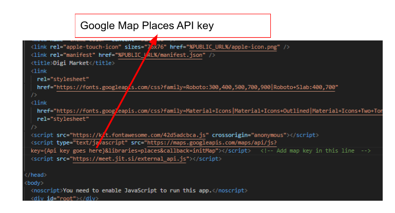
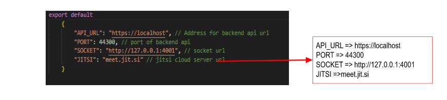
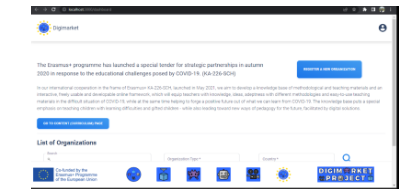

# DigiMarket_FrontEnd Repository  
### Requirements:  
`Node js v16.17.1`  
`yarn 1.22.11`  
1. First you have to add google map places api key in index.html file.The location of index.html file is ClientApp\public\index.html.  
Here is how to activate Google Places Api and javascript Map Api and get the Key.  
[https://developers.google.com/maps/documentation/places/web-service/get-api-key](https://developers.google.com/maps/documentation/places/web-service/get-api-key)  
  
2. To run the app locally you have to add 4 configuration strings in the env.js file. The location of the env.js file is ClientApp/src/env.js. You can leave these settings by default.  
  
3. Open the code in Visual Studio Code IDE or CMD and follow below instructions to run the front end app.  
After configuration you have to install all the packages inside the ClientApp folder using command:  
3.1 `yarn install`  
And then run a command:  
3.2 `yarn start`  
This will start the app and you can open the front end app.  
  
### Video Guide Below   
[https://www.awesomescreenshot.com/video/17734593?key=c12e45bcfac3af1aab565f50f5a805cf](https://www.awesomescreenshot.com/video/17734593?key=c12e45bcfac3af1aab565f50f5a805cf)